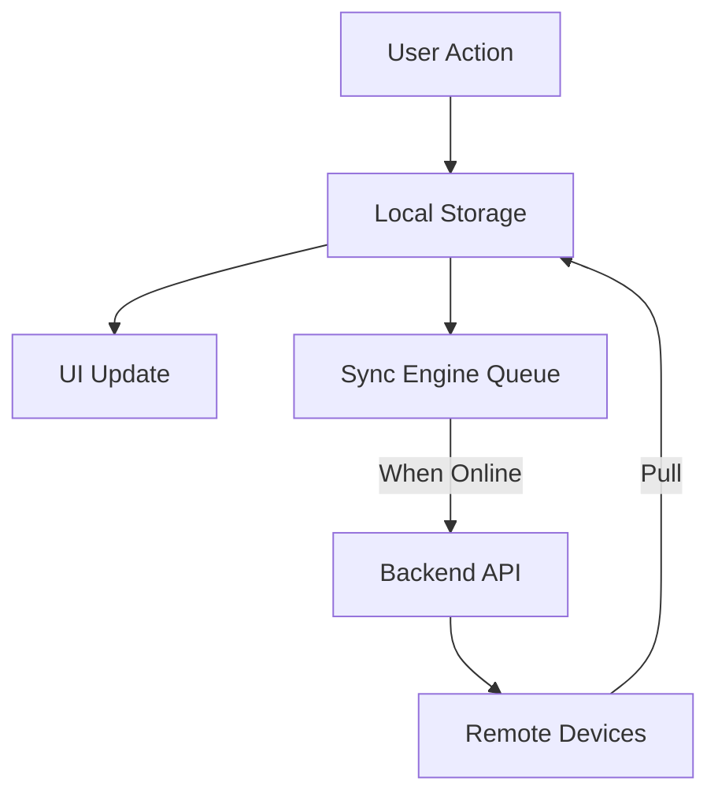

# ARCHITECTURE.md — family-sync-tasklist

---

## Introduction

The `family-sync-tasklist` app is a cross-platform Flutter/Dart application designed to provide families with a unified, reliable, and user-friendly space for managing shared tasks and shopping lists. Every item supports inline comments, fostering collaboration and clarity. The architecture is meticulously crafted to deliver a seamless offline-first experience, robust data durability, eventual consistency across devices, and a consistent, accessible user interface on web, desktop, and mobile platforms.

This document details the architectural foundations, main components, data flow, synchronization strategies, and cross-platform considerations that underpin the app. It is intended as a comprehensive reference for contributors and maintainers, ensuring that the system remains modular, testable, and extensible as it evolves.

---

## High-Level System Overview

At its core, `family-sync-tasklist` is architected around the following principles:

- **Offline-first functionality**: All features are fully usable without connectivity; local storage is the primary source of truth for the UI.
- **Data durability**: No user data is ever lost; all changes are immediately persisted to durable local storage.
- **Eventual consistency**: All updates are eventually synchronized across every device and user in the family group, with robust conflict resolution.
- **Separation of concerns**: Clear boundaries between data models, sync logic, and UI components.
- **Cross-platform consistency**: Identical core features and behaviors across web, Windows, macOS, Linux, Android, and iOS, with platform-specific optimizations where necessary.
- **Security and privacy**: Data is protected at rest and in transit, with appropriate access controls and encryption.

The system is composed of four main architectural layers:

1. **User Interface (UI) Layer**: Presents data and handles user interactions, adapting responsively to each platform.
2. **Local Storage Layer**: Provides durable, transactional persistence for all user data, abstracted to support multiple storage backends.
3. **Sync Engine**: Manages background synchronization, change tracking, conflict resolution, and communication with the backend.
4. **Backend API**: Serves as the authoritative source for shared data, supporting batch sync operations, versioning, and access control.

Each layer is modular, testable, and designed for extensibility.

---

## Main Components

### 1. User Interface (UI) Layer

#### Responsibilities

- Render tasks, shopping items, and inline comments.
- Provide intuitive controls for creating, editing, deleting, and commenting.
- Display sync status, offline indicators, and conflict notifications.
- Adapt layout and interaction patterns for each supported platform.
- Ensure accessibility and inclusivity for all users.

#### Architectural Patterns

- **MVVM (Model-View-ViewModel)**: Views are stateless and declarative; ViewModels manage UI state and business logic, interacting with repositories.
- **Unidirectional data flow**: Data flows from repositories to ViewModels to Views; user actions are dispatched as commands back to the data layer.
- **Platform adaptation**: Uses Flutter’s widget system to deliver native-feeling experiences on each platform, leveraging Material and Cupertino widgets as appropriate.

#### Cross-Platform Considerations

- **Responsive layouts**: LayoutBuilder, MediaQuery, and adaptive widgets ensure optimal presentation on all screen sizes and input methods.
- **Platform-specific widgets**: Conditional imports and abstraction layers provide native controls (e.g., Cupertino for iOS, Material for Android, desktop conventions for Windows/macOS/Linux).
- **Accessibility**: Semantic labels, high-contrast modes, and adjustable font sizes are standard.

---

### 2. Local Storage Layer

#### Responsibilities

- Persist all user data (tasks, comments, metadata) immediately and durably.
- Support transactional updates, write-ahead logging, and recovery from crashes or power failures.
- Provide efficient querying, indexing, and migration capabilities.
- Abstract over platform-specific storage backends (SQLite, Isar, Hive, IndexedDB, etc.).

#### Storage Backends

- **Mobile/Desktop**: SQLite (via Drift or sqflite), Isar, or Hive, chosen based on platform capabilities and performance needs.
- **Web**: IndexedDB or localStorage, wrapped in a unified API for consistency.

#### Data Model

- **Tasks**: Unique identifier (UUID), title, description, completion status, timestamps, sync metadata, and a list of inline comments.
- **Inline Comments**: Unique identifier, parent task reference, author, content, timestamps, sync metadata.
- **Metadata**: Version numbers, logical clocks or timestamps, conflict flags, and sync status indicators.

#### Durability and Integrity

- **Immediate persistence**: All changes are written to local storage as soon as they occur.
- **Defensive programming**: Write-ahead logging, checksums, and integrity checks on startup.
- **Migrations**: Automated, backward-compatible schema migrations with thorough testing.
- **Backups and recovery**: Support for exporting/importing data and restoring from snapshots.

#### Abstraction

- **Repository pattern**: All data access is routed through repository classes, which abstract over the underlying storage and provide a consistent API to the rest of the app.

---

### 3. Sync Engine

#### Responsibilities

- Track all local changes (creates, edits, deletes) that have not yet been synchronized.
- Schedule and execute background sync operations (push/pull) with the backend.
- Resolve conflicts deterministically, using last-write-wins (LWW) or CRDTs as appropriate.
- Provide real-time feedback to the UI about sync status, errors, and conflicts.
- Optimize for battery, bandwidth, and resource usage.

#### Sync Workflow

- **Change tracking**: Every local modification is tagged with sync metadata (e.g., needsSync flag, action type, version/timestamp).
- **Push**: Local unsynced changes are batched and uploaded to the backend via a batch API endpoint.
- **Pull**: Remote changes (from other devices/users) are fetched and merged into the local store.
- **Conflict detection**: If the same item is modified both locally and remotely, the sync engine applies the configured conflict resolution strategy.
- **Status updates**: The engine emits sync status events (syncing, success, error) to the UI layer for user feedback.

#### Scheduling and Resource Management

- **Automatic sync**: Triggered on connectivity changes, app startup, and periodically in the background (e.g., every 5 minutes).
- **Manual sync**: Users can trigger a sync via UI controls if desired.
- **Background tasks**: Uses platform-specific mechanisms (e.g., WorkManager, background isolates) to perform sync even when the app is not in the foreground.
- **Resource awareness**: Sync is deferred or throttled based on connectivity, battery status, and user activity.

#### Conflict Resolution

- **Default**: Last-write-wins (LWW) based on reliable timestamps or logical clocks.
- **Advanced**: For lists of comments or checklist items, field-level merges or CRDTs (Conflict-Free Replicated Data Types) are used to preserve all user intent.
- **User intervention**: Where automatic resolution is insufficient, the app surfaces conflicts with clear explanations and options for manual resolution.

#### Observability and Testability

- **Instrumentation**: Logging, analytics, and error reporting are built in for monitoring sync health and diagnosing issues.
- **Unit and integration tests**: Cover all sync scenarios, including offline edits, concurrent changes, and recovery from failures.

---

### 4. Backend API

#### Responsibilities

- Serve as the authoritative source for shared family data.
- Support batch push/pull operations for efficient synchronization.
- Enforce access control, authentication, and authorization.
- Maintain versioning, conflict detection, and audit trails.
- Provide endpoints for data export, import, and recovery.

#### API Design

- **Batch endpoints**: Accept and return batches of changes (creates, updates, deletes) to minimize round-trips and improve performance.
- **Versioning**: Each item includes version numbers or timestamps for conflict detection.
- **Idempotency**: Endpoints are designed to be idempotent, allowing safe retries.
- **Security**: All communication is encrypted (HTTPS/TLS); authentication tokens are required for all operations.
- **Extensibility**: The API is designed to accommodate future enhancements (e.g., real-time collaboration, advanced permissions).

#### Platform Support

- The backend is agnostic to client platforms, supporting all devices via standard HTTP(S) APIs.

---

## Offline-First Behavior

### Core Principles

- **Local-first**: The local device is always the primary source of truth for the UI; all operations (read, write, edit, comment) are performed against local storage.
- **Immediate feedback**: User actions are reflected instantly in the UI, regardless of connectivity.
- **Deferred sync**: Network operations (syncing with the backend) occur in the background and never block user interactions.
- **Graceful degradation**: The app remains fully functional offline; only sync-dependent features (e.g., sharing with new devices) are unavailable until connectivity is restored.

### Implementation Strategies

- **Optimistic updates**: UI updates immediately on local changes; sync is attempted in the background.
- **Change queue**: All unsynced changes are queued with metadata for later upload.
- **Fallbacks**: If a network call fails, the app retries automatically and informs the user only if manual intervention is needed.
- **Sync indicators**: The UI displays subtle indicators for unsynced items and overall sync status (e.g., icons, banners, or badges).

### Data Durability

- **Transactional writes**: All changes are persisted atomically to local storage.
- **Crash recovery**: On startup, the app verifies data integrity and recovers from partial writes or corruption.
- **No data loss**: Even in the event of crashes, power failures, or device restarts, all user data is preserved.

---

## Eventual Sync and Consistency

### Eventual Consistency Model

- **Guarantee**: All updates—whether made online or offline—are eventually synchronized across every device and user in the family group.
- **Temporary divergence**: The system accepts brief periods where devices may have different views, prioritizing availability and responsiveness.
- **Convergence**: Once all changes are synced, every participant’s view converges to the same state.

### Sync Engine Details

- **Push/pull operations**: The sync engine alternates between uploading local changes and fetching remote updates.
- **Batching**: Changes are batched to minimize network usage and improve efficiency.
- **Retry logic**: Failed syncs are retried automatically, with exponential backoff and error reporting.
- **Conflict detection**: The engine compares version numbers, timestamps, or vector clocks to detect concurrent modifications.
- **Conflict resolution**: Applies LWW or CRDT strategies as configured; surfaces unresolved conflicts to the user for manual intervention.

### Sync Metadata

- **Identifiers**: Each item (task, comment) has a globally unique identifier (UUID), generated locally for new items and mapped to backend IDs on sync.
- **Versioning**: Items include version numbers or logical clocks for conflict detection.
- **Timestamps**: All changes are timestamped for ordering and reconciliation.
- **Sync status**: Each item tracks whether it is synced, pending, or in conflict.

### Background Sync

- **Scheduling**: Sync is triggered on connectivity changes, app startup, and at regular intervals (e.g., every 5 minutes).
- **Resource management**: Sync is deferred or throttled based on battery, connectivity, and user activity.
- **Platform support**: Uses WorkManager, background isolates, or equivalent mechanisms on each platform to enable background sync.

---

## Data Flow: Tasks and Inline Comments

### Creation

1. **User action**: User creates a new task or comment via the UI.
2. **Local persistence**: The new item is immediately written to local storage, assigned a UUID, and marked as unsynced.
3. **UI update**: The UI reflects the new item instantly, with a visual indicator if it is pending sync.
4. **Sync queue**: The change is added to the sync engine’s queue for later upload.

### Editing

1. **User action**: User edits a task or comment.
2. **Local update**: The change is applied to local storage, version/timestamp incremented, and marked as unsynced.
3. **UI update**: The UI reflects the edit immediately, with sync status updated.
4. **Sync queue**: The change is queued for upload.

### Deletion

1. **User action**: User deletes a task or comment.
2. **Soft delete**: The item is marked as deleted in local storage (tombstone), pending sync.
3. **UI update**: The item is hidden or marked as deleted in the UI.
4. **Sync queue**: The deletion is queued for upload.

### Inline Comments

- **Association**: Comments are linked to their parent task by ID.
- **Threading**: Comments may be displayed in a threaded or grouped view.
- **Sync**: Comments follow the same offline-first and sync workflow as tasks.

### Data Flow Diagram

*Note: This diagram illustrates the unidirectional data flow from user action to local storage, UI update, sync queue, backend, and remote devices. All changes are persisted locally first and only later synchronized.*

---

## Cross-Platform Support

### Supported Platforms

- **Web**: Runs in modern browsers, using IndexedDB/localStorage for persistence.
- **Windows/macOS/Linux**: Native desktop apps, using SQLite (Drift/sqflite), Isar, or Hive for storage.
- **Android/iOS**: Native mobile apps, using SQLite (Drift/sqflite), Isar, or Hive for storage.

### Abstraction Strategies

- **Storage abstraction**: Repository interfaces hide platform-specific storage details, allowing for easy swapping of backends.
- **Platform adapters**: Conditional imports and platform channels provide access to native features (e.g., notifications, background tasks).
- **UI adaptation**: Responsive layouts, adaptive widgets, and platform-specific controls ensure a native feel on every device.

### Consistency and Optimization

- **Identical core features**: All platforms support the same task and comment workflows, offline-first behavior, and sync logic.
- **Performance tuning**: Storage and sync operations are optimized for each environment (e.g., batching on mobile, leveraging native notifications on desktop).
- **Testing**: Automated tests cover all platforms to ensure reliability and usability.

---

## Security, Privacy, and Encryption

### Data Protection

- **At rest**: Local storage is encrypted where possible (e.g., using platform keystores, secure storage plugins).
- **In transit**: All network communication uses HTTPS/TLS.
- **Access control**: Only authorized users can view or modify shared lists; authentication is required for all backend operations.

### Privacy

- **User data**: Tasks, comments, and personal information are visible only to family members.
- **Export/delete**: Users can export or delete their data at any time.
- **Compliance**: The app adheres to relevant privacy regulations (e.g., GDPR, COPPA).

---

## Testing, Observability, and Instrumentation

### Testability

- **Unit tests**: Cover all data models, repositories, and sync logic.
- **Widget tests**: Verify UI components and user interactions.
- **Integration tests**: Simulate end-to-end workflows, including offline scenarios, sync edge cases, and conflict resolution.
- **Fakes and mocks**: Used extensively to isolate components and test in controlled environments.

### Observability

- **Logging**: All layers emit structured logs for debugging and monitoring.
- **Analytics**: Usage patterns and error rates are tracked (with user consent) to guide improvements.
- **Error reporting**: Automatic reporting of crashes, sync failures, and data integrity issues.

---

## Modularity, Separation of Concerns, and Dependency Injection

### Modularity

- **Layered architecture**: UI, data, and sync layers are strictly separated.
- **Reusable components**: Each feature is encapsulated in modular, testable classes.
- **Extensibility**: New features can be added without impacting existing code.

### Separation of Concerns

- **Data models**: Define structure and validation for all entities; platform-agnostic and serializable.
- **Repositories**: Abstract data access and persistence.
- **Sync logic**: Handles all aspects of change tracking, conflict resolution, and backend communication.
- **UI components**: Render data and handle user input, relying on ViewModels for state.

### Dependency Injection

- **DI frameworks**: Uses Provider, GetIt, or Riverpod to inject dependencies and manage lifecycles.
- **Testability**: DI enables easy mocking and replacement of components for testing.

---

## Platform-Specific Features

### Notifications

- **Local notifications**: Used to remind users of due tasks or new comments, leveraging platform APIs.
- **Push notifications**: Supported via Firebase Cloud Messaging (FCM) or equivalent, for real-time updates across devices.

### Background Tasks

- **Sync scheduling**: Background sync is implemented using WorkManager, background isolates, or equivalent on each platform.
- **Resource management**: Sync is paused or throttled based on battery, connectivity, and user activity.

### Data Migrations, Backups, and Recovery

- **Schema migrations**: Automated and backward-compatible, with thorough testing.
- **Backups**: Users can export/import data for recovery or migration to new devices.
- **Recovery**: Automatic recovery from corruption or partial writes on startup.

---

## UI Indicators and User Feedback for Sync Status

- **Offline indicator**: Banner or icon shows when the app is offline.
- **Sync progress**: Subtle indicators (e.g., spinner, badge) show when sync is in progress.
- **Unsynced changes**: Items pending sync are visually marked (e.g., with an icon or color tag).
- **Conflict alerts**: Clear, actionable notifications are shown when conflicts require user intervention.
- **Non-intrusive feedback**: Snackbars, banners, or status bars are used instead of blocking dialogs.

---

## Performance and Scalability

- **Efficient data structures**: Tasks and comments are indexed for fast querying and updates.
- **Lazy loading and pagination**: Large lists are loaded incrementally to avoid blocking the UI.
- **Batch operations**: Writes and syncs are batched to minimize resource usage.
- **Profiling and optimization**: Regular profiling identifies and addresses bottlenecks.

---

## Future-Proofing and Extensibility

- **Modular codebase**: Designed for easy addition of new features (e.g., real-time collaboration, advanced permissions).
- **Open standards**: Data formats and APIs adhere to open standards for interoperability.
- **Community contributions**: Clear documentation and modularity encourage external contributions.

---

## Summary Table: Component Responsibilities

| Component         | Responsibilities                                                                 | Key Technologies / Patterns           |
|-------------------|----------------------------------------------------------------------------------|---------------------------------------|
| UI Layer          | Render data, handle input, display sync status, adapt to platform                | Flutter widgets, MVVM, Provider/GetIt |
| Local Storage     | Durable persistence, transactional updates, migrations, backups                   | SQLite (Drift/sqflite), Isar, Hive    |
| Sync Engine       | Change tracking, background sync, conflict resolution, status reporting           | Custom sync logic, background tasks   |
| Backend API       | Batch sync, versioning, access control, data export/import                       | REST API, HTTPS/TLS                   |
| Security/Privacy  | Encryption, authentication, access control, compliance                            | Platform keystores, secure storage    |
| Testing/Observability | Unit/integration tests, logging, analytics, error reporting                   | Flutter test, logging frameworks      |

---

## Conclusion

The architecture of `family-sync-tasklist` is grounded in robust offline-first principles, data durability, and eventual consistency, ensuring that families can rely on the app anytime, anywhere. By maintaining strict separation of concerns, modularity, and cross-platform consistency, the system is both resilient and extensible. Contributors and maintainers are encouraged to adhere to these architectural guidelines to preserve reliability, inclusivity, and technical excellence as the app evolves.

---

**For further details on implementation, refer to the codebase, PRINCIPLES.md, and PROJECT_OVERVIEW.md. This document will be updated as the architecture evolves.**
Great — I’m on it. I’ll now generate a fully structured, cross-platform `ARCHITECTURE.md` for the `family-sync-tasklist` app, grounded in your uploaded documents and aligned with your core principles.

This will take me several minutes, so feel free to leave — I'll keep working in the background. Your report will be saved in this conversation.
